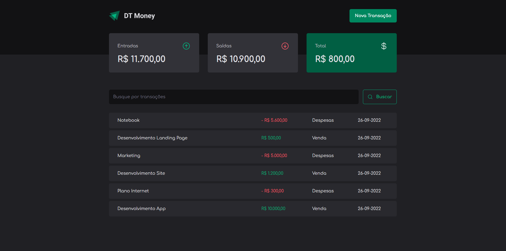
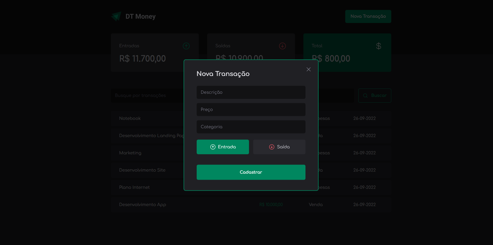

# 🚀 DT Money

Projeto criado para estudo. Objetivo e ter um controle de gastos podendo cadastrar as entradas e saidas.

# 🧠 Contexto

Funcionalidades:

- [ ] Adicionar Entrada/Saida
- [ ] Calculos
- [ ] Modal
- [ ] Consumir Api
- [ ] Api Json Server

## 📋 Tecnologias

- React.js
- Typescript
- Styled Components

## ✏️ Feito por Diogo Travalha
